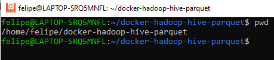

# <span style="color:blue">Comandos básicos Linux (usando distribución Ubuntu) julio 2022</span>

**Comentario: antes que memorizar comandos, conviene pensar las siglas o alias a la cual hacen referencia. Por ejemplo: 'pwd' no es mas que Print Working Directory, 'rm' es una abreviación de Remove, como 'cp' es de Copy, 'ls' de List y 'cd' de Change Directory.**


```
CARPETAS DEL SISTEMA
```


```
El signo de dólar ($) significa que es un USUARIO "NORMAL", muchas veces con restricciones en cuanto a permisos.
Numeral o hash (#) significa que usted estas ejecutando los comandos como ADMINISTRADOR (root)
```



Ejecución comandos con permisos de admin

```
sudo comando
```
Directorio actual
```
pwd
```


Actualizar Ubuntu

 ```
 apt upgrade -y
 ```


Usar '&&' para varios comandos seguidos
```
 apt update -y && apt upgrade -y
 ```

Crear usuario

```
sudo useradd nombreusuario
```

Para agregar usuarios a grupos, por ejemplo, grupo sudo

```
sudo usermod -aG sudo nombreusuario
```

Eliminar usuario

```
sudo userdel nombreusuario
```

Cambiar la contraseña

```
passwd
```

Ver los grupos a los que pertenece el usuario

```
group nombreusuario
``` 

Para saber el nombre del host

```
hostname
```
 
Para cambiar el nombre

```
hostnamectl set-hostname nuevonombre
```

Instalar programas, por ejemplo, Visual Studio Code: 

```
sudo apt install code -y
```

Crear y navegar a las carpetas
```
mkdir carpeta
cd /carpeta 
```
Volver al directorio anterior
```
cd ..
```

Crear un archivo vacio:

```
 touch nombrearchivo
```
 
Crear un archivo con un texto corto:

```
 echo "Texto corto" > nombrearchivo
```

Si usamos >> agregamos el texto sin reemplazar el archivo. 

```
 echo "Agregamos texto nuevo" >> nombrearchivo
 ```


Leer/ver contenido de archivo corto:

 ```
 cat archivo
 more archivo
 less archivo
 ```
 
Con el editor nano podemos ver y editar archivos más grandes:

 ```
 nano nombrearchivo
 ```
 
Con Ctrl-x guardamos los cambios.

Limpiar la pantalla en la terminal
```
 clear
```
Encontrar un archivo en el sistema:

```
find / -name archivo
```
** Usar `sudo` antes del comando si se requieren permisos.

Ver la historia del terminal

```
history
```
* Para limpiar el historial ``history -c`` (bash)

Mostrar toda la estructura de los ficheros:

```
tree
```
Copiar archivos de un sitio a otro:

 ```
 cp carpeta/archivo carpeta/
 ```
 
Crear copia con nuevo nombre

```
 cp archivo nuevoarchivo
```

Renombrar archivos (no guarda la copia anterior)

```
 mv archivo nuevoarchivo
 ```

Listar archivos 

```
ls
ls -l 
```
Para mover archivos hacemos lo mismo. Si es una carpeta, agregar -r.

``` 
mv -r carpeta/ /carpeta/destino
 ```

Mover todos los archivos de una carpeta a otra

```
mv -r carpeta/ * /destino/
```

Para eliminar archivos y carpetas:
 ```
 rm nombrearchivo
 rm -r /carpeta
 
```
** OJO!! , ``#sudo rm -r /*``  puede traer problemas, ELIMINA TODO

Crear links a archivos, por ejemplo, al "``archivo1``"

```
link archivo1 archivo2
```

Saber que binarios tenemos instalados:

```
ls /bin/ && ls /usr/bin
```

Para saber dispositivos conectados a los puertos USB:

```
lsusb
```

Para saber el porcentaje de uso de los discos disponibles:

```
df --total -hl
```

Para saber la memoria RAM disponible 

```
grep MemTotal /proc/meminfo
# o
free -m
```

Ver las conexiones en los sockets de nuestro equipo

```
ss
ss -l
ss | grep tcp
ss -t -a 
```
Para conocer los usuarios logueados en el sistema:

```
who
```

IP local y Wifi.

```
 ifconfig
 ip address
 iwconfig
```

IP pública

```
curl ifconfig.me
curl https://ipinfo.io/ip
```

Ruta

```
ip route
route -n
```

Enviar peticiones a servidores online o en red local

```
ping google.com
ping 192.168.1.1
```
 
Usuario y tiempo conectado
```
uname -r
uptime -p
```

 
Si queremos saber donde está un dispositivo USB, disco duro y sus particiones:

 ```
 sudo fdisk -l
 ```
Los procesos del sistema pueden mostrarse con:

```
 top
 htop
 ps -ef | less
 ```
El signo | nos permite concatenar comandos (pipes).

Imprimir todos los procesos en un momento determinado

```
ps -ef
```

Detalles del Hardware y bios del sistema

```
dmidecode
```

Con neofetch podemos ver detalles del sistema (``apt install neofetch``)

 ```
 neofetc
 ```
 
Descomprimir archivos
 
 ```
 unzip * .zip
 gunzip example.txt.gz
 ```

Reiniciar Wifi 

```
service network-manager restart
```

Detener proceso 

 ```
 top
 kill idproceso
 ```

Características del sistema

```
 lshw
 lscpu
```

Ver lista de fuentes 

```
nano /etc/apt/sources.list
```

Controlar los permisos para la accesibilidad de los archivos y carpetas
```
# por ejemplo, dar todo tipo de acceso a un archivo
 sudo chmod 777 nombrearchivo
 sudo chmod a+rwx nombrearchivo
 #O para que solamente root pueda acceder
 sudo chmod 700 nombrearchivo
```
Acceso a carpeta para todos los usuarios:
```
chmod ugo+rwx nombrecarpeta
```


## Encontrar palabras con ``grep`` o ``egrep``
```
touch example
ls | egrep example

```
Buscar palabra en archivo

```
look texto archivo`` o grep texto archivo
```


## Manejo de archivos

Para listar los archivos que tengan un patrón, por ejemplo, que terminen en .iso. 

 ```
 ls | grep * .iso
 ```
 
Para saber el número de archivos en una carpeta:

``` 
ls | wc -l
```

Conocer la cantidad de filas en un archivo

```
wc -l archivo
```


Para acceder a las 10 primeras y últimas filas:

 ```
 head -10 archivo
 tail -10 archivo
 ```

Si el archivo es demasiado grande, podemos separarlo en varias partes

```
split -n l/5 archivo x
```

Para seleccionar la quinta columna, utilizamos:

```
awk '{print $5}' archivo
```

Separar columnas en función de un caracter, por ejemplo, dos puntos (:)

 ```
 cut -d ':' -f1 archivo
 ```

Obtener la primera fila de datos

```
sed 1d archivo
```


Cortar una sección intermedia de filas
```
sed -n '250, 260p' archivo1.txt > archivo2.txt
```

Crear un secuencia ``seq 1 10``

## Para buscar archivos

```
sudo apt-get install mlocate
locate -i archivo
```


## Programas importantes


Firewall
```
ufw allow 22/tcp # o ufw allow 2222/tcp
ufw allow from 202.54.1.1 to any port 22
ufw limit ssh
ufw status
```
Detener y deshabilitar:
```
systemctl stop ssh
systemclt disable ssh
```

### Wget 


Para descargar archivos de un servidor o pagina web. 

```
wget -A pdf,csv,txt,png,jpg -m -p -E -k -K -np www.programandoconro.wordpress.com
```

Descargar el index.html y los links asociados a la pagina.

```
wget -rpk www.programandoconro.wordpress.com
```

### Git

Para descargar un repositorios Git:

 ```
 git clone https://github.com/progamandoconro/My-Lynux-Locker
 ```
 
Para actualizar el repositorio local a partir de GitHub:

 ```
 git pull origin master
 ```
 
Los commits y los push se pueden hacer directamente en GitHub. 

## Programación (Bash Script)

### Declarar variables:

          mivar="HOLA-MUNDO!!"
          echo $mivar
          yes $mivar

### Leer input del usuario:

          read -p "Escribir saludo: " -r saludos
          echo "$saludos para vos también"

### For 

          for i in {1..10} ; do 
              echo "hola $i"; 
          done

           
            for i in $( ls ); do
                echo item: $i;
                sleep 1;
            done 

            
            for i in `seq 1 10`;
            do
                    echo $i
            done    
            
            for e in {0..9};do echo $e🍀; done;
            
### While
              
             COUNTER=0
             while [  $COUNTER -lt 10 ]; do
                 echo The counter is $COUNTER
                 let COUNTER=COUNTER+1 
             done
    
### Until
              
             COUNTER=20
             until [  $COUNTER -lt 10 ]; do
                 echo COUNTER $COUNTER
                 let COUNTER-=1
             done
             
### If
             
             if [ hola == hola ]; then
                 echo TRUE;
                 else 
                     echo FALSE;
             fi
             
             VAR="Hello Amit";
             if [[ $VAR == *Amit* ]];
                 then echo "its Amit";
                 else
                     echo "Its not Amit";
             fi
             
### Aritmética   

             echo $((((2+2-3)*3)/3))
             
### Funciones

             function chao {
               echo 'Chau amigo!';
               exit;
             }


Salir, reiniciar, apagar en 30 min, apagar ahora, respectivamente.

```
 exit
 reboot
 shutdown -h +30
 poweroff -f
 
 ```
 
# Links a Posts Relacionados:

https://programandoconro.wordpress.com/2019/10/02/mis-99-comandos-favoritos-en-gnu-linux/
https://programandoconro.wordpress.com/2020/01/02/10-trucos-en-linux-para-programadores-principiantes/
https://programandoconro.wordpress.com/ssh-accede-a-tu-red-local-y-programa-remotamente/
